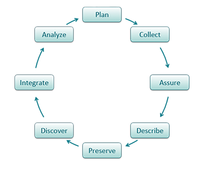

## Lesson 8: How to write quality metadata

Tutorials on Data Management

## Learning Objectives

After completing this lesson, participants will be able to:

* List preparatory steps for writing metadata
* Explain how and why to write quality metadata

## The DataONE Data Life Cycle

<section>
  <aside class="notes">
    Metadata creation is a part of the “Describe” step in the data lifecycle. 

  </aside>
</section>

##  6 Steps to Creating Quality Metadata
1. Organize your information.
	*Did you write a project abstract to obtain funding for your proposal? Re-use it in your metadata! 
	*Did you use a lab notebook or other notes during the data development process that define measurements and other parameters? 
	*Do you have the contact information for colleagues you worked with?
	*What about citations for other data sources you used in your project?

## 
2. Write your metadata using a metadata tool
3. Review the record for accuracy and completeness
4. Have someone else read & review your record
5. Revise the record based on comments from reviewer
6. Review the record and then publish!

## Tips for writing quality metadata
1. Do not use jargon
2. Define technical terms and acronyms
3. Clearly state data limitations (eg. completeness, omissions) and considerations for data reuse
4. Use "none" or "unknown" meaningfully
	*"None" usually means that you knew about data and nothing existed (e.g., a “0” cubic feet per second discharge value)
	*"Unknown" means that you don’t know whether that data existed or not (e.g., a null value)

## Titles!
5. Titles are critical for helping others find your data
	*Complete titles include: What, When, Where, Who, and Scale.
	*Informative titles include: topic, timeliness of the data, specific information about place and geography

## Example: Which is better?

A: Rivers

B: Greater Yellowstone Rivers from 1:126,700 U.S.Forest Service Visitor Maps (1961-1983)

## More Tips for Writing Quality Metadata
6. Be specific! Quantify when you can.
	Example: 
	"We checked our work using a random sample of 5 monitoring sites, reviewed by 2 people. We determined our work to be 95% complete based on these inspections."

## More Tips for Writing Quality Metadata
7. Select keywords wisely
8. Use descriptive & clear writing
9. Fully qualify geographic locations
10. Use standard domain thesauri for keywords when possible (eg. USGS Biocomplexity Thesaurus)

## More Tips for Writing Quality Metadata
11. Remember: a computer will read your metadata
12. Do not use symbols that could be misinterpreted 
13. Do not use tabs, indents, or line feeds
14. When copying and pasting from other sources, use a text editor to eliminate hidden characters 

## Summary

Review your final product to make sure that the documentation represents all of the information necessary to use or reuse the data.

Remember: a well-written title and good keywords are critical to data discovery!

## 
The full slide deck may be downloaded from: http://www.dataone.org/education-modules
Suggested citation:
DataONE Education Module: How to Write Good Quality Metadata. DataONE. Retrieved Nov12, 2012. From http://www.dataone.org/sites/all/documents/L08_WriteQualityMetadata.pptx 

Copyright license information: No rights reserved; you may enhance and reuse for your own purposes.  We ask that you provide appropriate citation and attribution to DataONE.

